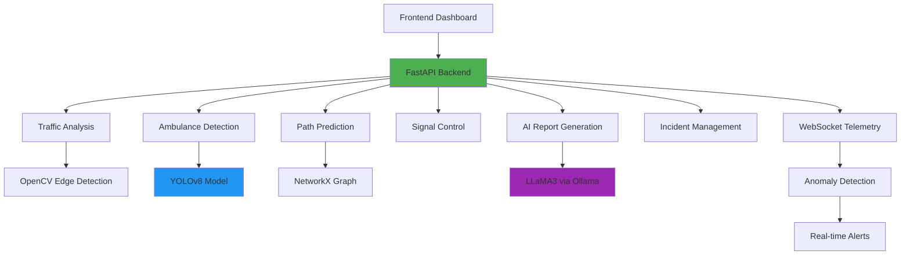

# CityFlow — Intelligent Traffic Control System

> AI-powered traffic monitoring and emergency vehicle priority system with computer vision and real-time anomaly detection.

---

## Overview

CityFlow is an intelligent traffic management system that uses computer vision and machine learning to monitor traffic intersections, detect emergency vehicles, and automatically optimize traffic signals for emergency response. The system combines real-time image analysis, path prediction, and AI-powered incident reporting to improve emergency vehicle response times.

### Problem Being Solved

Emergency vehicles often face delays at traffic intersections, which can be critical during time-sensitive medical emergencies. Traditional traffic systems don't have real-time awareness of approaching emergency vehicles or the ability to predict their routes.

### Solution

CityFlow provides:
- **Real-time traffic analysis** using computer vision
- **Emergency vehicle detection** with YOLOv8
- **Predictive path planning** for ambulance routes
- **Automatic signal control** for emergency vehicle priority
- **Real-time telemetry monitoring** with anomaly detection
- **AI-powered incident reporting** using LLaMA3

---

## Key Features

### 🚗 Traffic Analysis
- **Multi-direction traffic classification** (LOW/MEDIUM/HIGH) using edge density analysis
- **Real-time intersection monitoring** from 4 camera directions (North, South, East, West)
- **Automated traffic density calculation** using OpenCV Canny edge detection

### 🚑 Emergency Vehicle Detection
- **YOLOv8-based ambulance detection** with confidence scoring
- **High-confidence detection threshold** (0.7) for safety-critical decisions
- **Direction-specific detection** to identify ambulance approach direction

### 🚦 Intelligent Signal Control
- **Emergency mode activation** when ambulance detected
- **Normal mode operation** for regular traffic flow
- **Automatic signal plan generation** based on detected scenarios

### 🗺️ Path Prediction & Pre-clearing
- **Shortest path calculation** using NetworkX graph algorithms
- **ETA prediction** at each intersection along the route
- **Predictive signal pre-clearing** (8 seconds before ambulance arrival)
- **Route optimization** for emergency vehicles

### 📡 Real-time Telemetry & Anomaly Detection
- **WebSocket-based real-time monitoring** of ambulance telemetry
- **Anomaly detection** for:
  - Stuck at intersection (45+ seconds)
  - Speed drops below 5 km/h
  - Route deviation from planned path
  - Signal override failures (critical)
- **Severity-based alerting** (CRITICAL, HIGH, MEDIUM, LOW)

### 📋 Incident Management
- **Incident lifecycle tracking** (start, active, completed)
- **Route logging** and signal override counting
- **Anomaly recording** during emergency response
- **Total response time calculation**

### 🤖 AI-Powered Reporting
- **LLaMA3-based incident report generation** using Ollama
- **Professional incident summaries** with recommendations
- **Structured report format** for post-incident analysis

---

## Architecture



### System Flow

1. **Traffic Monitoring**: Camera images from 4 directions are uploaded to the analysis endpoint
2. **Computer Vision Processing**: OpenCV analyzes traffic density, YOLOv8 detects ambulances
3. **Decision Engine**: System determines emergency vs. normal mode based on detection
4. **Path Prediction**: For emergencies, NetworkX calculates optimal route and ETA
5. **Signal Control**: Traffic signals are adjusted based on the decision
6. **Real-time Monitoring**: WebSocket connection monitors ambulance telemetry
7. **Anomaly Detection**: System detects and alerts on abnormal behavior
8. **Incident Tracking**: Complete incident lifecycle is logged
9. **AI Reporting**: LLaMA3 generates professional incident reports

---

## Technology Stack

| Layer | Technology |
|-------|------------|
| **Frontend** | React 18, TypeScript, Vite |
| **UI Framework** | Radix UI, Tailwind CSS |
| **Charts** | Recharts |
| **Animations** | Framer Motion |
| **Routing** | React Router DOM |
| **Backend** | FastAPI, Python |
| **Server** | Uvicorn |
| **Computer Vision** | OpenCV, YOLOv8 (Ultralytics) |
| **Graph Algorithms** | NetworkX |
| **Machine Learning** | Scikit-learn |
| **AI/LLM** | LLaMA3 (via Ollama) |
| **Real-time** | WebSocket (FastAPI) |
| **Data Validation** | Pydantic |

---

## Project Structure

```
CityFlow/
├── backend/                 # Python FastAPI backend
│   ├── app.py              # Main FastAPI application with endpoints
│   ├── traffic_classifier.py # Traffic density analysis
│   ├── ambulance_detector.py # YOLOv8 ambulance detection
│   ├── decision_engine.py  # Signal control decision logic
│   ├── signal_controller.py # Signal plan generation
│   ├── city_graph.py       # NetworkX city graph definition
│   ├── path_predictor.py   # Path prediction and ETA calculation
│   ├── anomaly_detector.py # Real-time anomaly detection
│   ├── incident_logger.py  # Incident lifecycle management
│   ├── report_generator.py # LLaMA3 AI report generation
│   ├── models/             # YOLOv8 model files (place .pt files here)
│   ├── outputs/            # Incident logs and reports (generated)
│   ├── temp_uploads/       # Temporary image uploads (generated)
│   └── requirements.txt   # Python dependencies
├── src/                    # React frontend
│   ├── pages/             # Dashboard pages
│   │   ├── CityFlowDashboard.tsx  # Main traffic dashboard
│   │   ├── DriverDashboard.tsx    # Driver/emergency view
│   │   ├── AnalyticsDashboard.tsx # Analytics and metrics
│   │   ├── RouteOptimization.tsx  # Path planning UI
│   │   ├── EmergencyPriority.tsx  # Emergency management
│   │   ├── PredictionInsights.tsx # ETA predictions
│   │   ├── SimulationMode.tsx     # Traffic simulation
│   │   └── Settings.tsx           # System settings
│   ├── services/          # API service layer
│   │   └── cityflowApi.ts # Backend API integration
│   ├── components/        # Reusable UI components
│   └── hooks/            # Custom React hooks
├── public/               # Static assets
├── package.json          # Frontend dependencies
├── vite.config.ts        # Vite configuration
└── tsconfig.json         # TypeScript configuration
```

---

## How It Works

### Traffic Analysis Flow

1. User uploads 4 camera images (North, South, East, West)
2. System processes each image with OpenCV edge detection
3. Traffic density is calculated and classified (LOW/MEDIUM/HIGH)
4. YOLOv8 model detects ambulance presence and confidence
5. Decision engine determines emergency vs. normal mode
6. Signal control generates appropriate traffic signal plan

### Emergency Response Flow

1. Ambulance detection triggers emergency mode
2. Path predictor calculates shortest route to hospital using NetworkX
3. ETA is calculated for each intersection along the route
4. Predictive pre-clearing schedule is generated (8 seconds before arrival)
5. WebSocket connection established for real-time telemetry
6. Anomaly detector monitors for stuck vehicles, speed drops, route deviations
7. Signal override failures trigger critical alerts
8. Incident is logged with complete lifecycle data
9. LLaMA3 generates professional incident report on completion

---

## Getting Started

### Prerequisites

- **Python 3.9+**
- **Node.js 18+**
- **Ollama** (for LLaMA3 report generation)
- **YOLOv8 model** (placed in `backend/models/`)

### Installation

#### 1. Clone the Repository

```bash
git clone https://github.com/KR0079384/CityFlow.git
cd CityFlow
```

#### 2. Backend Setup

```bash
cd backend

# Create virtual environment
python -m venv venv

# Activate virtual environment
# On Windows:
venv\Scripts\activate
# On macOS/Linux:
source venv/bin/activate

# Install dependencies
pip install -r requirements.txt

# Download YOLOv8 model (if not present)
# Place ambulance_yolov8.pt in backend/models/
```

#### 3. Frontend Setup

```bash
cd ..

# Install frontend dependencies
npm install
```

#### 4. Start Ollama (for AI Reports)

```bash
# Install Ollama from https://ollama.ai
# Pull LLaMA3 model
ollama pull llama3:8b
```

### Running the Application

#### Start Backend Server

```bash
cd backend
venv\Scripts\activate  # Windows
# source venv/bin/activate  # macOS/Linux

uvicorn app:app --reload --host 0.0.0.0 --port 8000
```

#### Start Frontend Development Server

```bash
# In a new terminal
cd CityFlow
npm run dev
```

The application will be available at:
- **Frontend**: http://localhost:8080
- **Backend API**: http://localhost:8000
- **API Documentation**: http://localhost:8000/docs

---

## API Documentation

### POST /analyze
Analyzes traffic intersection from 4 camera images.

**Request**: `multipart/form-data`
- `north_image`: File (camera image)
- `south_image`: File (camera image)
- `east_image`: File (camera image)
- `west_image`: File (camera image)

**Response**:
```json
{
  "intersection_id": "JNC_001",
  "mode": "EMERGENCY|NORMAL",
  "analysis": {
    "north": {
      "traffic_level": "HIGH",
      "edge_density": 0.342,
      "ambulance_detected": true,
      "confidence": 0.85
    },
    "south": { ... },
    "east": { ... },
    "west": { ... }
  },
  "signal_plan": {
    "north": "GREEN",
    "south": "RED",
    "east": "RED",
    "west": "RED"
  },
  "reason": "Ambulance detected on north approach"
}
```

### POST /predict-path
Predicts optimal path and ETA for emergency vehicle.

**Request Body**:
```json
{
  "current_intersection": "INT_01",
  "destination": "HOSPITAL_A",
  "speed_mps": 11.0
}
```

**Response**:
```json
{
  "path": ["INT_01", "INT_02", "INT_03", "HOSPITAL_A"],
  "eta_seconds": [13.6, 31.8, 66.3],
  "pre_clear_schedule": [
    {
      "intersection": "INT_02",
      "clear_at_seconds": 5.6,
      "ambulance_arrives_at": 13.6
    },
    ...
  ],
  "total_eta_seconds": 66.3
}
```

### WebSocket /ws/telemetry/{ambulance_id}
Real-time telemetry monitoring for anomaly detection.

**Client sends**:
```json
{
  "position": "INT_03",
  "speed": 25.5,
  "signal_state": "GREEN"
}
```

**Server responds**:
```json
{
  "ambulance_id": "AMB_001",
  "anomalies": [
    {
      "type": "speed_drop",
      "severity": "MEDIUM",
      "message": "Ambulance AMB_001 moving below 5 kmph",
      "intersection": "INT_03",
      "timestamp": 1699876543.21
    }
  ],
  "anomaly_count": 1
}
```

### POST /start-incident
Creates a new emergency incident.

**Request Body**:
```json
{
  "ambulance_id": "AMB_001",
  "destination": "HOSPITAL_A"
}
```

### POST /close-incident/{incident_id}
Closes an incident and calculates total response time.

### POST /generate-report/{incident_id}
Generates AI-powered incident report using LLaMA3.

### GET /incidents
Retrieves all logged incidents.

---

## Screenshots

*Note: Screenshots can be added to demonstrate the dashboard interfaces and traffic analysis results.*

---

## Challenges & Engineering Decisions

### Computer Vision Approach
**Decision**: Used edge density analysis for traffic classification instead of deep learning.
**Reasoning**: Edge density is computationally efficient and provides sufficient traffic level classification for the use case. Deep learning would be overkill for simple LOW/MEDIUM/HIGH classification.

### YOLOv8 for Ambulance Detection
**Decision**: Chose YOLOv8 over other object detection models.
**Reasoning**: YOLOv8 provides excellent real-time performance with good accuracy, making it suitable for safety-critical ambulance detection where confidence scores matter.

### High Confidence Threshold
**Decision**: Set ambulance detection confidence threshold to 0.7.
**Reasoning**: False positives in emergency vehicle detection could cause unnecessary traffic disruption. High threshold ensures reliable detection before triggering emergency mode.

### NetworkX for Path Planning
**Decision**: Used NetworkX graph library for shortest path calculation.
**Reasoning**: NetworkX provides efficient graph algorithms and is well-suited for city intersection networks with weighted edges (distances).

### Predictive Pre-clearing
**Decision**: Implemented 8-second pre-clear buffer before ambulance arrival.
**Reasoning**: Provides sufficient time for signal changes while avoiding unnecessary early clearing that could disrupt regular traffic.

### WebSocket for Telemetry
**Decision**: Used WebSocket instead of HTTP polling for real-time monitoring.
**Reasoning**: WebSocket provides bidirectional, low-latency communication essential for real-time anomaly detection and alerts.

### LLaMA3 for Report Generation
**Decision**: Used local LLaMA3 via Ollama instead of cloud APIs.
**Reasoning**: Privacy, cost, and latency considerations. Local inference keeps incident data private and avoids API costs.

---

## Future Improvements

- **Real camera integration**: Connect to actual traffic cameras instead of image uploads
- **Multi-vehicle coordination**: Handle multiple emergency vehicles simultaneously
- **Historical analytics**: Add long-term traffic pattern analysis
- **Mobile optimization**: Enhanced mobile interface for field operators
- **ML model improvement**: Train custom YOLOv8 model on local traffic data
- **Cloud deployment**: Deploy backend to cloud for scalability
- **Database integration**: Replace file-based incident storage with proper database
- **Advanced anomaly detection**: Incorporate more sophisticated ML-based anomaly detection
- **Traffic prediction**: Add ML-based traffic flow prediction
- **City-scale deployment**: Extend from single intersection to city-wide system

---

## Environment Variables

The following environment variables are currently supported:

### Backend Configuration

| Variable | Purpose | Default | Example |
|----------|---------|---------|---------|
| `CITYFLOW_CORS_ORIGIN` | Allowed CORS origin for frontend communication | `http://localhost:8080` | `http://localhost:3000` |
| `CITYFLOW_OLLAMA_MODEL` | Ollama model used for incident report generation | `llama3:8b` | `llama3.1:8b` |

### Frontend Configuration

The frontend backend URL is centralized in `src/lib/apiConfig.ts`:

```typescript
export const BACKEND_BASE_URL = "http://localhost:8000";
```

---

## API Reference

### REST Endpoints

#### `GET /health`
Health check endpoint.
- **Response**: `{"status": "ok", "model": "loaded"}`

#### `POST /analyze`
Analyze traffic intersection images from 4 directions.
- **Request**: Multipart form data with `north_image`, `south_image`, `east_image`, `west_image`
- **Response**: Traffic analysis per direction, signal plan, and mode decision
- **Errors**: `415` for unsupported file types, `413` for files exceeding 10 MB

#### `POST /predict-path`
Predict ambulance route and ETA.
- **Request**: `{"current_intersection": "INT_01", "destination": "HOSPITAL_A", "speed_mps": 11.0}`
- **Response**: `{"path": [...], "eta_seconds": [...], "pre_clear_schedule": [...], "total_eta_seconds": 140.0}`
- **Errors**: `400` for unknown intersection nodes

#### `GET /api/driver/live`
Get current driver live-state based on active incidents.
- **Response (active)**: `{"incident_id": "...", "ambulance_id": "AMB-01", "hospital_name": "HOSPITAL_A", "eta_seconds": 140.0, "distance_km": 1.54, "corridor_active": true, "emergency_mode": true, "incident_status": "ACTIVE", "advisory": "..."}`
- **Response (idle)**: `{"corridor_active": false, "emergency_mode": false, "incident_status": "IDLE", "advisory": "No active incident. Standing by."}`

#### `POST /start-incident`
Start a new emergency incident.
- **Request**: `{"ambulance_id": "AMB-01", "destination": "HOSPITAL_A"}`
- **Response**: Incident object with status `ACTIVE`

#### `GET /incidents`
List all incidents.
- **Response**: JSON array of incident objects

#### `POST /close-incident/{incident_id}`
Close an active incident.
- **Response**: Updated incident with status `COMPLETED`
- **Errors**: `{"error": "Incident not found"}` for unknown IDs

#### `POST /generate-report/{incident_id}`
Generate AI incident report (requires Ollama).
- **Response**: `{"incident_id": "...", "report": "..."}`
- **Errors**: `{"error": "Incident not found"}` for unknown IDs

### WebSocket Endpoints

#### `WS /ws`
General-purpose broadcast WebSocket. Echoes JSON messages to all connected clients.

#### `WS /telemetry/{ambulance_id}`
Real-time ambulance telemetry anomaly detection.
- **Request**: `{"position": "INT_01", "speed": 10.0, "signal_state": "GREEN"}`
- **Response**: `{"ambulance_id": "AMB-01", "anomalies": [...], "anomaly_count": 0}`

---

## Telemetry Input Validation

The telemetry WebSocket implements input validation to prevent malformed data from being interpreted as legitimate operational telemetry:

| Input | Behavior |
|-------|----------|
| Valid numeric speed | Anomaly detector receives telemetry normally |
| Genuine speed=0.0 | Treated as legitimate stationary ambulance telemetry |
| Missing speed | Anomaly evaluation skipped — does NOT become 0.0 |
| Null speed | Anomaly evaluation skipped — does NOT become 0.0 |
| Non-numeric speed | Anomaly evaluation skipped — does NOT become 0.0 |
| Malformed JSON | Does not crash the WebSocket |

This is input validation behavior, NOT real-world ambulance telemetry integration. Real vehicle telemetry hardware is not implemented.

---

## Driver Dashboard Data Availability

The DriverDashboard uses a combination of backend-authoritative data and frontend-demo state:

### Backend-Authoritative / Computed
- `ambulance_id` — from active incident
- `hospital_name` — from incident destination
- `eta_seconds` — computed via path predictor
- `distance_km` — computed via city graph
- `corridor_active` — derived from active incident state
- `emergency_mode` — derived from active incident state
- `advisory` — computed from corridor and ETA
- `incident_status` — from incident state

### Not Currently Available from Backend
The following fields currently use frontend/demo defaults:
- Route progress
- Fuel percentage
- Driver profile
- Patient priority
- GPS status
- Network status
- Control link status
- AI suggestions
- Incident messages

---

## LLM Dependency

Report generation depends on an available Ollama runtime.

- **Model**: `llama3:8b` (configurable via `CITYFLOW_OLLAMA_MODEL`)

---

## Testing

### Backend Regression Suite
```
venv\Scripts\python.exe -m unittest test_api -v
```
**Current verified count**: 20 tests PASS

Coverage areas:
- Health check
- CORS configuration
- Image analysis (valid, unsupported, traversal, oversized)
- Path prediction (valid route, unknown nodes)
- Incident lifecycle (create, list, close, report)
- Driver live state (idle)
- Telemetry WebSocket (malformed input, type validation, sequential messages, anomaly semantics)

### Frontend Build
```
npm run build
```
**Status**: PASS

---

## Current Limitations

- No authentication
- No database (file-based incident storage)
- Report generation depends on Ollama availability
- Real vehicle telemetry integration is not implemented
- Some DriverDashboard fields remain frontend/demo state
- No real camera integration (image upload only)

---

## Security Baseline

- CORS is configurable via `CITYFLOW_CORS_ORIGIN`
- Default local CORS origin is `localhost:8080`
- Upload validation restricts file types and size (10 MB limit)
- Allowed image extensions: `.jpg`, `.jpeg`, `.png`, `.webp`
- Filesystem paths are cwd-independent
- No authentication currently exists

---

## Verification Status

| Component | Status |
|-----------|--------|
| Backend regression suite (20 tests) | PASS |
| Frontend build | PASS |
| API contract | PASS |
| Telemetry validation | PASS |
| Incident persistence | PASS |
| Driver live API | PASS |

---

## License

This project is provided as-is for educational and demonstration purposes.

---

## Author

**Mohamed Rafeeq Khan A**

- Portfolio: [https://portfolio-2027-five.vercel.app](https://portfolio-2027-five.vercel.app)
- GitHub: [https://github.com/Mohamedrxf](https://github.com/Mohamedrxf)

---

## Acknowledgments

- **YOLOv8** by Ultralytics for object detection
- **NetworkX** for graph algorithms
- **FastAPI** for the backend framework
- **Ollama** for local LLaMA3 inference
- **Radix UI** for frontend components